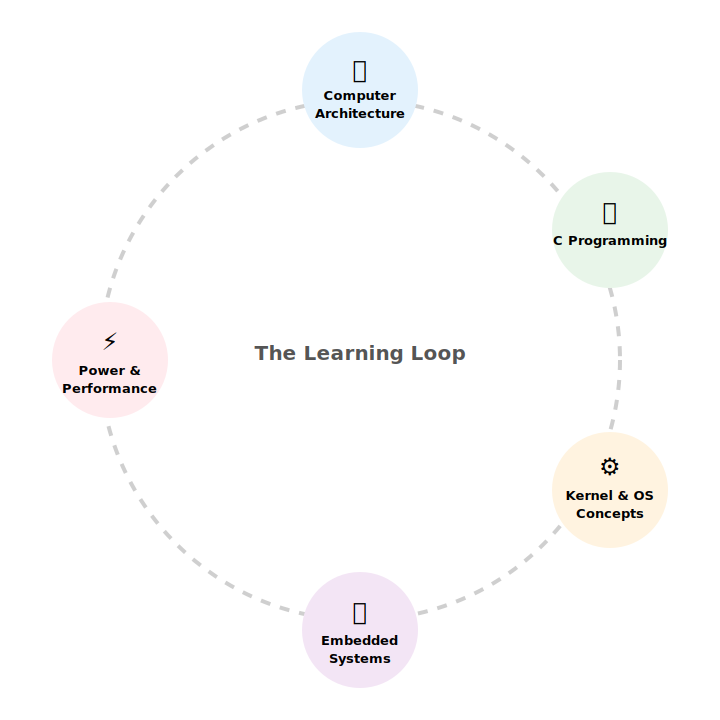

A systems engineering blog following a continuous learning loop:

**computer architecture → C programming → kernel & OS concepts → embedded systems essentials → power and performance engineering**

This site connects fundamentals with real-world systems like **Linux**, **Android**, and **ARM-based SoCs**.

---

## 🔁 The Learning Loop

👉 Click any topic to explore that section.

